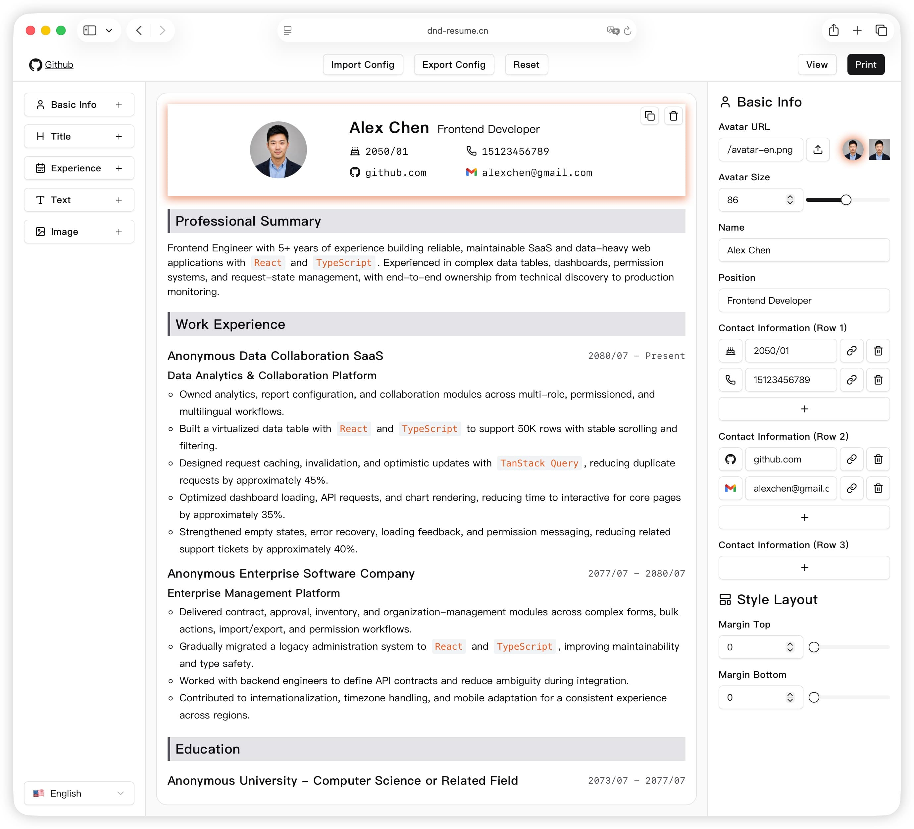

# dnd-resume — Build Your Resume Online

A local-first, drag-and-drop resume builder for creating and exporting
professional PDF resumes directly in your browser.

[简体中文](./README.zh-CN.md) · [Live Demo](https://dnd-resume.cn)

## Usage

1. Open the [Live Demo](https://dnd-resume.cn).
2. Drag resume sections to reorder them, then edit their content and styles.
3. Click **View** to preview your resume.
4. Click **Print** and choose **Save as PDF** in your browser's print dialog.

You can also use **Import Config** and **Export Config** to back up or move
your resume configuration.

## 🔗 相关工具 / Related tools

- [简历大师 Resume Master](https://markmiller1.github.io/resume-master/) — 免费、纯前端、隐私优先的简历生成器，64 套模板 + 面试/谈薪指南，数据不出本机
