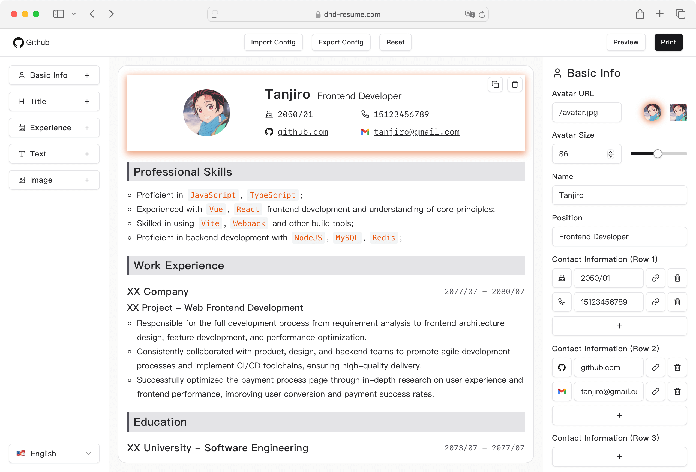

# dnd-resume —— 在线制作你的简历

一款本地优先的拖拽式简历制作工具，让你可以直接在浏览器中创建并导出专业的 PDF 简历。

[English](./README.md) · [在线演示](https://dnd-resume.cn)

## 使用方法

1. 打开[在线演示](https://dnd-resume.cn)。
2. 拖动简历区块调整顺序，然后编辑内容和样式。
3. 点击 **查看** 预览简历。
4. 点击 **打印**，在浏览器的打印对话框中选择 **存储为 PDF**。

你还可以使用 **导入配置** 和 **导出配置** 来备份简历配置，或在不同浏览器之间迁移配置。

